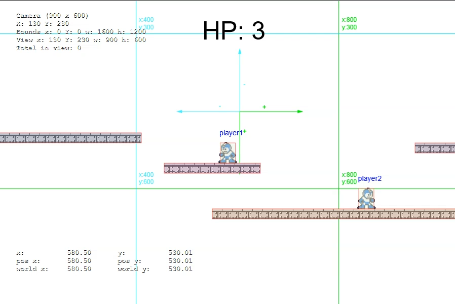

# Multiplayer Phaser Game

Small online game made in 2016 to learn more about Node.js and Socket IO. Has a fighting game style combo system made with finite state machines. The physics and collisions are calculated server-side.

Node 6, Socket IO, Phaser and p2.js for physics.

